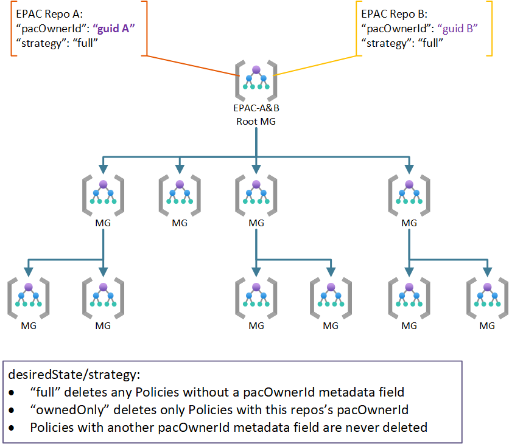
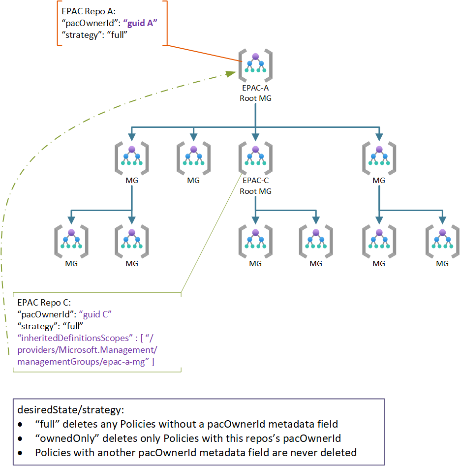
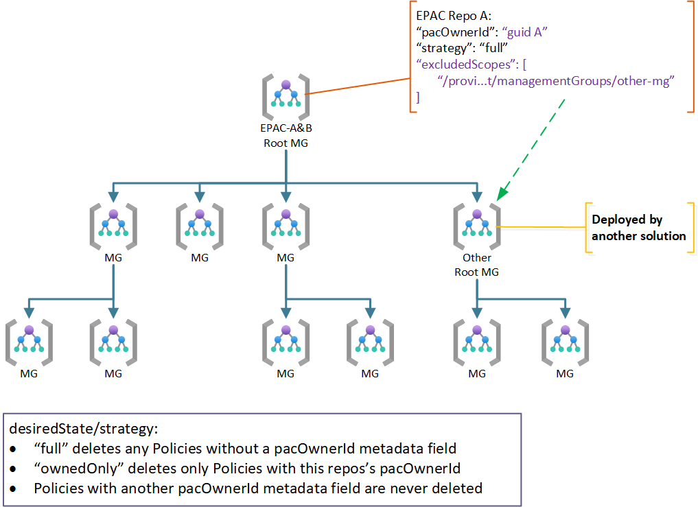

# Desired state strategy

Desired State strategy enables shared responsibility scenarios. the following documents the archetypical use cases. For complex scenarios it is possible to combine multiple use cases (e.g., Use case 2a and 3, use case 1 and 2a, ...).

## Use Case 1: Centralized Team

This original (previously the only) use case assumes one team/repo manages all Policies in a tenant or multiple tenants. You should not have any of the following elements in `global-settings.jsonc`:

* `inheritedDefinitionsScopes`
* `desiredState`

## Use Case 2: Shared Responsibility

In a shared responsibility model multiple teams manage the same tenant(s) at the same scope. Additionally, a variant of this use case is well suited to what previously was called `brownfield` which needs to preserve Policy resources deployed prior to EPAC. The following diagram shows two EPAC solutions managing the same root (tenant). Other Policy as Code solutions can also participate if the solution sets `metadata.pacOwnerId`.



For standard behavior where each repo manages, no additional entries in `global-settings.jsonc` are necessary since the default strategy `full` is the default. `full` deletes any Policy resources without a `pacOwnerId`; however, id does not delete Policy resources with a different `pacOwnerId`.

You may add the following JSON for clarity/documentation of the default behavior.

``` json
"desiredState": {
    "strategy": "full",
}
```

## Use Case 3: Brownfield Transition

While transitioning to EPAC, existing Policy resources may need to be kept. **Breaking change:** Previously this was accomplished with the `brownfield` variable in the pipeline used to set the `SuppressDeletes` flag on the planning script. Unfortunately, the previous approach was to course- grained, preventing an EPAC solution to remove its own deprecated Policy resources. Setting `desiredState` to `ownedOnly` allows EPAC to remove its own resources while preserving brownfield instances.

``` json
"desiredState": {
    "strategy": "ownedOnly",
}
```

## Use Case 4: Hierarchical Organization

The hierarchical model allows a central team to manage the commonality while giving parts of the organization a capability to further restrict resources with Policies. This is a common scenario in multi-national corporations with additional jurisdictional requirements (e.g., data sovereignty, local regulations, ...).

Additionally, it is possible for a solution at a child scope to inherit Policy definitions.



Repo A is managed the same as in use cases 1, 2 and 2a. Repo C sets sets the same as repo B in use case 2 or 2a. If inheriting Policy definitions from the parent EPAC solution, add `inheritedDefinitionsScopes` to `global-settings.jsonc`. Inherited definition scopes used but not managed by this repository, scopes must be visible from `deploymentRootScope`.

``` jsonc
"inheritedDefinitionsScopes": [],
"desiredState": {
    "strategy": "full",
}
```

## Use Case 5: Exclude some Scopes and Policy Resources

In rare cases you may need to exclude individual child scopes, or Policy resources from management by an EPAC solution.

By default, Policy Assignments at resource groups are not managed by EPAC. Prior to v6.0, managing resource groups was to expensive. If you used the `-includeResourceGroup` switch in prior versions, set `includeResourceGroups` to `true` to achieve the same effect.



You can exclude any combination of scopes, Policies, Policy Sets and Policy Assignments. Simple wild cards are allowed.

``` json
"desiredState": {
    "strategy": "full",
    "includeResourceGroups": false,
    "excludedScopes": [
        // Management Groups
        // Subscriptions
        // Resource Groups
    ],
    "excludedPolicyDefinitions": [
        // wild cards allowed
    ],
    "excludedPolicySetDefinitions": [
        // wild cards allowed
    ],
    "excludedPolicyAssignments": [
        // wild cards allowed
    ]
}
```

## Use case 6: Include Resource Groups

By default, Policy Assignments at resource groups are not managed by EPAC. Prior to v6.0, managing resource groups was to expensive. **Breaking change:** If you used the `-includeResourceGroup` switch in prior versions, set `includeResourceGroups` to `true` to achieve the same effect.

``` json
"desiredState": {
    "strategy": "full",
    "includeResourceGroups": true,
}
```

## Use case 7: Manage Policy Definitions, Assignments, or Exemptions differently

In some organizations the lifecycle of different parts may be managed separately. For example, you may have one repo to manage Definitions and Assignments separately from Exemptions. Since the ownership of Exemptions is managed from the Assignment `pacOwnerId`, changing it is not effective.

EPAC only manages items with a directory in the `Definitions` folder. Therefore, you can use the same `pacOwnerId` from  two repos and remove the folders to separate them. In this example:

* Repo1: `Definitions` contains `policyDefinitions`, `policySetDefinitions` and `policyAssignments` folders.
* Repo2: `Definitions` contains `policyExemptions` folder.

## Reading List

* [Setup DevOps Environment](operating-environment.md) .
* [Create a source repository and import the source code](clone-github.md) from this repository.
* [Select the desired state strategy](desired-state-strategy.md)
* [Define your deployment environment](definitions-and-global-settings.md) in `global-settings.jsonc`.
* [Build your CI/CD pipeline](ci-cd-pipeline.md) using a starter kit.
* Optional: generate a starting point for the `Definitions` folders:
  * [Extract existing Policy resources from an environment](extract-existing-policy-resources.md).
  * [Import Policies from the Cloud Adoption Framework](cloud-adoption-framework.md).
* [Add custom Policies](policy-definitions.md).
* [Add custom Policy Sets](policy-set-definitions.md).
* [Create Policy Assignments](policy-assignments.md).
* Import Policies from the [Cloud Adoption Framework](cloud-adoption-framework.md).
* [Manage Policy Exemptions](policy-exemptions.md).
* [Document your deployments](documenting-assignments-and-policy-sets.md).
* [Execute operational tasks](operational-scripts.md).
